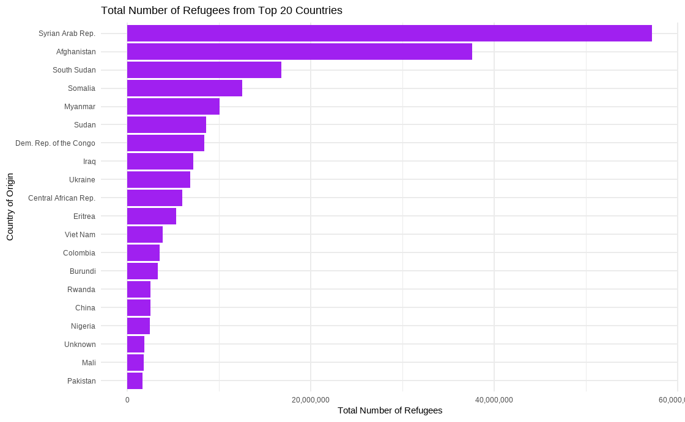
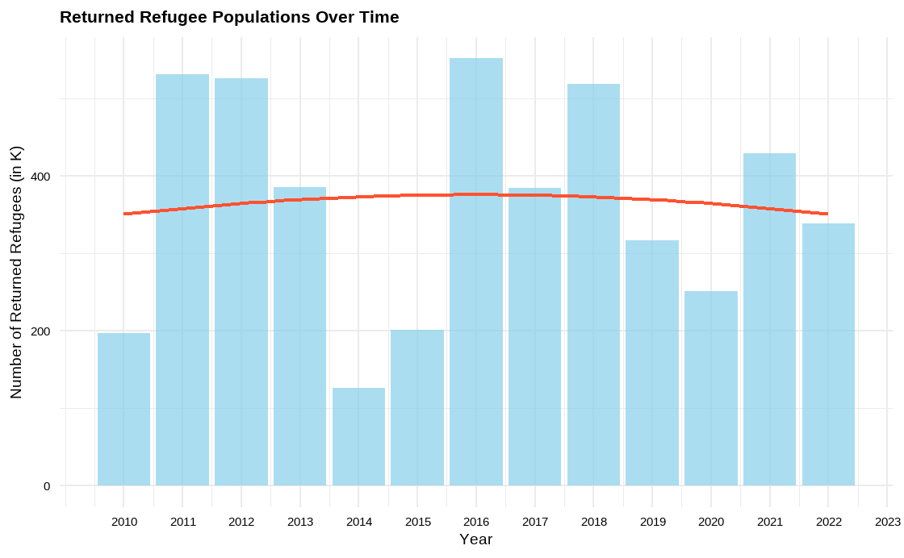
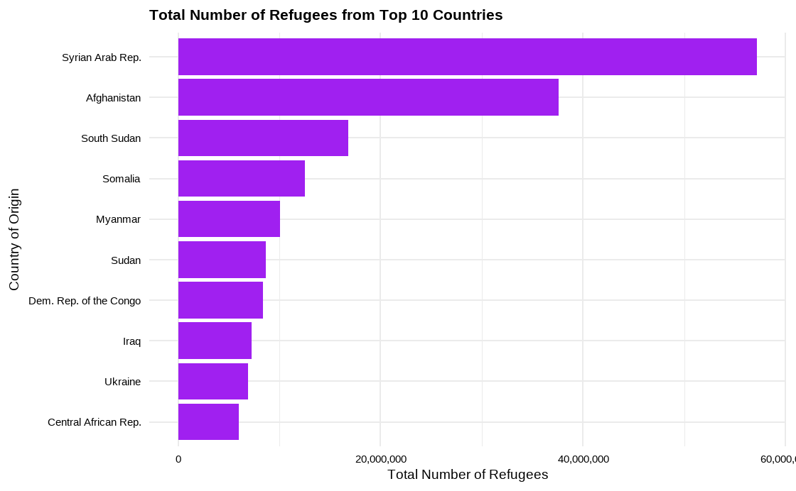
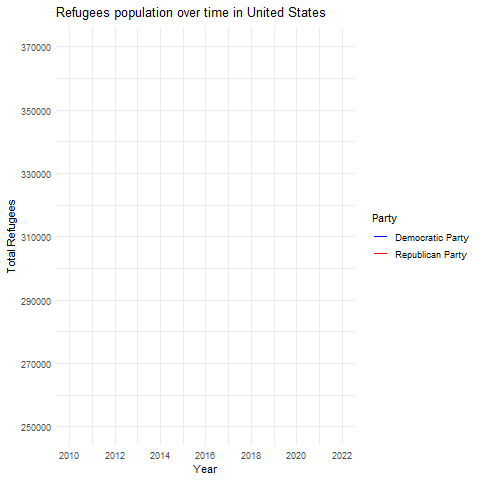
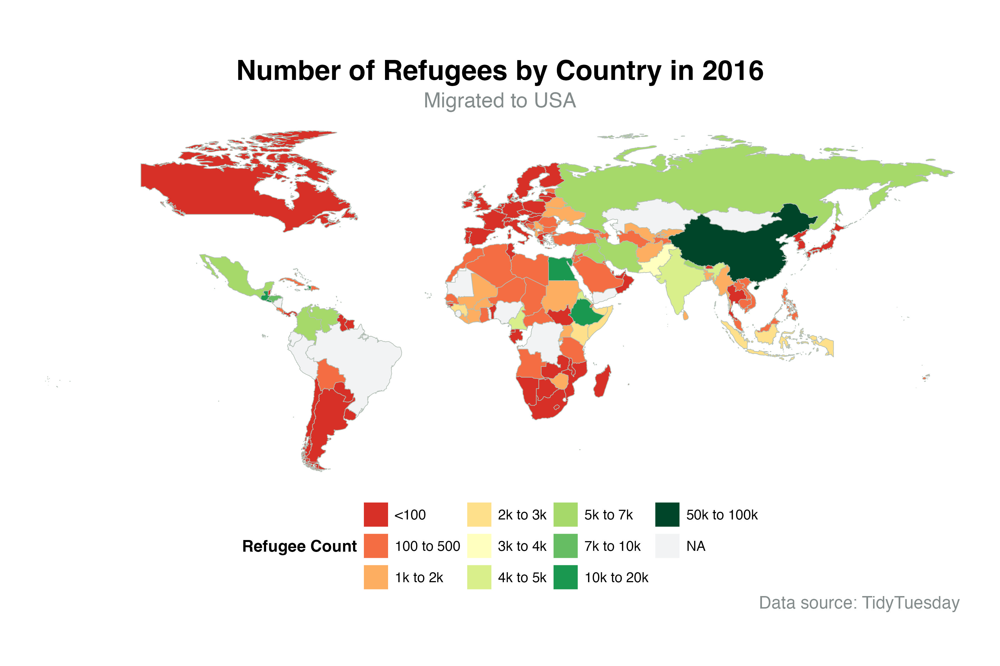
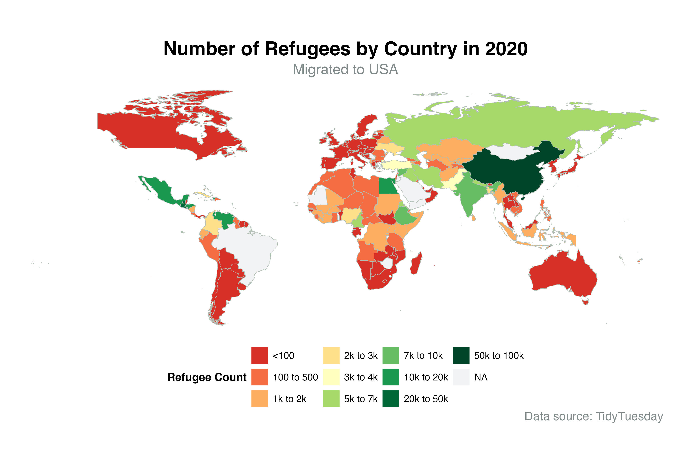
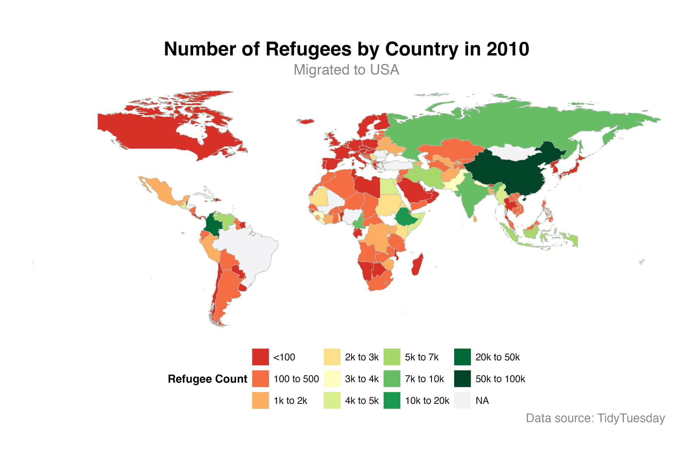

## Abstract

Using the rich dataset offered by the `{refugees}` R package, this project sets out on an adventurous trip across the complicated landscape of worldwide migration from 2010 to 2022. It offers a comprehensive picture of the numerous factors influencing the lives of refugees, internally displaced people (IDPs), asylum seekers, stateless people, and more, spanning over 64,000 entries from sources like UNHCR, UNRWA, and IDMC. This research tries to unravel the complex web of variables driving forced migration, from socioeconomic turbulence to environmental calamities and geopolitical upheavals, via thorough investigation.

Two key topics form the core of our investigation: how changing political ideologies in the US affect refugee trends, and how changes in external occurrences such as pandemics, conflicts, and climate change affect refugee numbers globally. Using time-series analysis and additional statistical techniques, we examine displacement patterns and correlate them with major political changes and global crises in order to identify underlying trends and causal relationships.

## Introduction

This project analyses more than 64,000 data from the {refugees} R package, covering the period from 2010 to 2022, in order to investigate the intricate dynamics of worldwide displacement. The dataset provides a detailed look at the lives of refugees, internally displaced people (IDPs), asylum seekers, and stateless people, among others. It is derived from UNHCR, UNRWA, and IDMC and sheds light on the complex dynamics of forced migration. The goal is to identify the complex interactions that exist between outside variables and their impacts on patterns of global displacement, including geopolitical conflicts, natural disasters, and sociopolitical upheavals.

The impact of US political positions on refugee trends and the general changes in worldwide refugee populations as a result of external factors like wars, climatic shifts, and health crises like the COVID-19 pandemic are central to our research. We want to analyse the complex relationship between major world events and displacement trends using time-series analysis and statistical evaluations.

## Question 1: How have the patterns in refugee populations evolved over time, and how have the stances of American political parties impacted these developments? Analyse the dynamics of refugee migrations towards US political environments.

### Introduction

Our project's first inquiry explores the complex interplay between international refugee movements and political processes in the United States. We seek to understand how changes in political party ideologies and governmental positions inside the United States may have affected patterns of refugee populations, paying particular attention to historical data from 2000 to 2024. This investigation is based on the theory that political discourse and policy choices coming from the United States can significantly impact worldwide displacement patterns, either by reshaping the geopolitical environment or by changing the country's own refugee accepting policies.

### Approach

We have adopted a multimodal analytic approach to this subject, combining a comparative assessment of political epochs in the United States with time-series analysis. For clarity and scalability in our visual representations, we first aggregate the overall number of refugees by year, normalizing the data to thousands. We can create a chronological narrative of refugee migrations by layering important political events and changes in the United States over these trends thanks to this basic data. We produce visual aids, such as bar plots and trend lines, using ggplot2 to clarify the relationship between refugee populations and changes in U.S. politics. Our research is further enhanced by the addition of data from returning refugees, which provides insights into the cyclical nature of displacement and resettlement.

### Data Preparation and Pre-processing

The preparation stage of the data is essential to transforming our data-set into a format that allows for effective analysis. Using the R dplyr package, we first aggregate our data by year before summarizing the overall number of refugees—making sure to divide these totals into thousands for easier comprehension. This procedure is also applied to data pertaining to refugees who have returned, yielding a parallel dataset that illustrates the flow of return movements in addition to original displacements. We also prepare by making the 'year' a numeric variable so that we can use it as an axis in both our static and animated visualization. The careful processing of the data paves the way for an in-depth investigation of the relationship between U.S. political positions and international refugee trends.


::: {.cell layout-align="center"}

```{.r .cell-code}
# Data Preparation - Aggregate total number of refugees by year and convert to thousands (K)
total_refugee_trends <- population_data %>%
  group_by(year) %>%
  summarise(total_refugees = sum(refugees, 
                                 na.rm = TRUE) / 1000)  # Convert to thousands
```
:::


### Analysis 01: Refugee populations over time.


::: {.cell layout-align="center"}

:::


The graphic illustrates the changes in overall refugee populations over time using a bar graph that shows annual fluctuations. It also includes a trend line that indicates a quadratic growth pattern.

**A. Expeditious growth of the refugee population over time**

Plot 01 clearly demonstrates the rapid expansion of the refugee population over time. The utilization of sky-blue bars in conjunction with an orange trend line aptly accentuates the fluctuations in refugee figures from the early 2010s to 2022. The y-axis, which represents the number of refugees in thousands, is displayed with comma separators for enhanced Expeditious growth of the refugee population over time clarity.


::: {.cell layout-align="center"}
::: {.cell-output-display}
{fig-align='center'}
:::
:::


**B. A small number of refugees have returned over a period of time**

Conversely, Plot 02 demonstrates that a limited number of refugees have repatriated throughout a specific duration. This graph is an effective tool for illustrating the dynamic nature of refugee populations, highlighting the rising trend and the urgent requirement for global attention and action in response to refugee crises.


::: {.cell layout-align="center"}
::: {.cell-output-display}
{fig-align='center'}
:::
:::


### Analysis 02: Refugees by year and country of origin


::: {.cell layout-align="center"}

:::


This figure displays the aggregate number of refugees originating from the top 20 nations. The bar chart depicts various countries, with each bar uniformly shaded in purple. The y-axis represents the arrangement of countries, while the x-axis represents the overall number of refugees. The bars are arranged in a manner that emphasizes the nations with the greatest number of refugees, facilitating the identification of the countries with the highest refugee populations. This type of representation facilitates a rapid comprehension of the worldwide refugee issue by illustrating the nations that are most impacted.

**A. Total Number of Refugees from Top 10 Countries**


::: {.cell layout-align="center"}
::: {.cell-output-display}
{fig-align='center'}
:::
:::

**B. Total number of asylum seekers from top 10 countries**


::: {.cell layout-align="center"}
::: {.cell-output-display}
{fig-align='center'}
:::
:::

### Analysis 03: Refugee populations over time with US political context


::: {.cell layout-align="center"}

:::

::: {.cell layout-align="center"}
::: {.cell-output-display}
{fig-align='center'}
:::
:::


This graph displays the temporal evolution of the refugee population in the United States, with different colors representing the governing political party. The blue lines indicate the years when the Democratic Party held power, while the red lines show the periods of Republican Party leadership. The graph illustrates the refugee population from 2010 to 2022, with the x-axis representing the years and the y-axis indicating the cumulative number of refugees. The analysis examines the fluctuations in the refugee population during various administrations, emphasizing the potential influence of political leadership on refugee admissions. The unambiguous and simplistic style facilitates viewers' comprehension of patterns in U.S. refugee admissions throughout the selected years.

### Discussion

The analysis reveals a nuanced relationship between US political leadership and refugee admissions, with discernible shifts aligning with changes in the ruling party. The fluctuating trends in refugee populations and asylum seeker data underscore the significant impact of political ideologies and policies on global displacement and migration patterns. Moreover, the cyclical nature of refugee returns and the concentration of refugees from specific countries highlight the complex interplay between global crises and US political responses.

## Question 2: How the global refugee population fluctuate across the countries? Is their any external factors impact on refugee population like COVID-19 or war or climate change or financial stability?

### Introduction

Understanding global refugee patterns is crucial for addressing humanitarian challenges and devising effective policy responses. In this analysis, we aim to explore the dynamics of refugee movements across nations over time, focusing on key variables such as `'year'`, `'coo_name'`, `'coa_name'`, and `'refugees'` data. By examining annual refugee data normalized against population statistics, we seek to uncover trends and link them to significant world events, including conflicts, climate disasters, and economic changes.

### Approach

Our approach involves gathering comprehensive data from various sources and applying time-series techniques to analyze refugee patterns. We utilize datasets from international organizations and government agencies, supplemented by demographic and socio-economic indicators. Through statistical analysis and data visualization using tools like ggplot2, we aim to discern patterns in refugee movements and understand the influence of external factors such as wars, climate disasters, and economic stability


::: {.cell layout-align="center"}

:::

::: {.cell layout-align="center"}

:::

::: {.cell layout-align="center"}

:::

::: {.cell layout-align="center"}

:::

::: {.cell layout-align="center"}

:::

::: {.cell layout-align="center"}

:::

::: {.cell layout-align="center"}

:::

::: {.cell layout-align="center"}

:::


### Analysis 01: War Effect in Year 2010-2016


::: {.cell layout-align="center"}
::: {.cell-output-display}
{fig-align='center' width=2469}
:::
:::


Early in the decade, migrations might be influenced by the aftermath of the global financial crisis of 2008, conflicts such as the war in Afghanistan or Iraq, or ongoing issues in countries like Somalia and china. This period may show increased migrations from the Middle East, particularly Syria, due to the Syrian Civil War beginning in 2011. Other regions might also exhibit changes due to local conflicts or economic instability.

### Analysis 02: Economic / Climate Conditions in Year 2016-2019


::: {.cell layout-align="center"}
::: {.cell-output-display}
{fig-align='center' width=2469}
:::
:::


The refugee crisis in Europe might influence numbers, with potential spillover effects on US Refugee/asylum applications. Policy changes in the USA regarding immigration during the new administration might also become visible. Continued conflicts and economic issues in various countries could maintain or increased refugee movements.

### Analysis 03: World Health Crisis and Policy Change in Year 2019-2022


::: {.cell layout-align="center"}
::: {.cell-output-display}
{fig-align='center' width=2469}
:::
:::


The COVID-19 pandemic would likely cause a significant drop in migrations worldwide due to travel restrictions and border closures. Post-pandemic recovery may lead to an increase in migrations as countries lift travel bans. The situation in Afghanistan post-US withdrawal could result in an increase in refugees from that region.

### Plot-Alpha


::: {.cell layout-align="center"}
::: {.cell-output-display}
{fig-align='center'}
:::
:::


While not typically classified as refugees, many Chinese nationals seek to leave China for economic opportunities. The relationship between China and the USA, including U.S. immigration policy, can influence refugee flows. Policies that allow for a greater number of asylum applications or provide specific provisions for individuals from China can result in higher refugee numbers. Additionally, there may be specific legislative acts or policies targeting the protection of certain groups from China, which could lead to an increase in accepted refugee applications.

### Discussion

The analysis underscores the intricate relationship between global refugee movements and external factors like conflicts, economic conditions, and climate changes. The varying trends across different periods highlight how events like wars, financial crises, and pandemics significantly shape refugee patterns. This insight is crucial for formulating responsive and informed humanitarian policies to address the complexities of global displacement.
## Challenges faced

-   Data only available from 2010 not before that
-   Animation and frame rate selection.
-   Error in data type and rendering method selection of gif during animation.

## Conclusion

We analyse refugee patterns over time across nations by analyzing `'year'`, `'coo_name'`, `'coa_name'`, and `'refugees'` data. To acquire a clearer understanding of the repercussions, we will gather annual refugee data by nation and normalize it against population statistics. Time-series techniques will be used in the study to find trends and link them to important world events including wars, climate disasters, and changes in the economy. Our goal is to quantify the influence of these events on displacement by examining refugee trends around them. The context provided by external data, such as conflict histories, records of climate events, economic indicators, and epidemic timelines, will help to create a complete picture of the variables influencing global refugee movements. This analysis of the **`{refugees}`** dataset highlights the significant influence of outside factors on patterns of worldwide displacement throughout the last ten years. We have learned how major changes in refugee and displacement patterns have been fueled by geopolitical conflicts, natural disasters, and global crises through thorough investigation. The results emphasize not only how urgent it is to deal with the underlying causes of displacement but also how important it is to have strong, well-informed responses to the intricate problems associated with forced migration. These kinds of data-driven analysis are essential for developing humanitarian actions and policies that effectively address the world's growing displacement crisis.

## References

\[1\] Title: Refugees, Source: tidytuesday, Link: <https://github.com/rfordatascience/tidytuesday/blob/master/data/2023/2023-08-22/readme.md>

\[2\] Analyzed some of the global trends of refugee population from UNHCR - "[https://www.unhcr.org/us/global-trends"](https://www.unhcr.org/us/global-trends")

\[3\] Quarto, For documentation and presentation - [Quarto](https://quarto.org/docs/reference/formats/html.html)

\[4\] ggplot, For understanding of different plot - [ggplot](https://ggplot2.tidyverse.org/reference/index.html)

